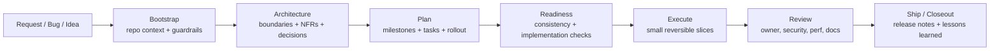

# CodexKit Engineer Pro Final Plus

English | [Tiếng Việt](README.vi.md) | [简体中文](README.zh-CN.md)

**Architecture-first operating system for Codex teams.**

CodexKit helps AI coding agents behave less like "vibe coders" and more like senior engineers: understand the repository first, make architecture and constraints explicit, plan in reviewable slices, validate honestly, and leave durable artifacts behind.

## Why Teams Use CodexKit

Most AI coding setups are good at producing diffs and bad at producing engineering discipline.

CodexKit fixes that by giving every repository a shared operating model:

- `AGENTS.md` for durable guidance and guardrails
- `.agents/skills/` for reusable workflows
- `.codex/agents/` for specialist delegation
- `plans/templates/` for spec, architecture, NFR, plan, task, rollout, and review artifacts
- `scripts/` for deterministic bootstrap, validation, and scaffolding
- `.github/workflows/` for CI-based Codex review and release checks

## In The Box

| Asset | Count | Purpose |
|---|---:|---|
| Agents | 22 | Specialized subagents for architecture, review, security, docs, debugging, release, and more |
| Skills | 35 | Reusable workflows for planning, execution, validation, and closeout |
| Aliases | 33 | `/ck:` and `$ck-` shortcuts over canonical skills |
| Templates | 23 | Delivery artifacts for `L0` to `L3` work |
| Workflows | 6 | Codex-powered GitHub automation for review, docs drift, release readiness, and architecture gates |
| Runbooks | 9 | Durable operational guidance for releases, rollback, debugging, and governance |

## What Makes It Different

- **Architecture-first, not code-first**
- **Spec -> architecture -> NFR -> plan -> tasks -> execute**
- **Explicit change classes** for tiny fixes, bounded features, cross-cutting work, and new systems
- **Rollback, observability, and maintainability** treated as first-class delivery requirements
- **Thin command layer** instead of a giant custom DSL
- **Durable repo memory** so future sessions do not start from zero

## Quick Start

### Publish-ready npm / npx install

After publishing this repository to npm as `create-codexkit`, users can install it like this:

```bash
npm create codexkit@latest my-repo
```

Or add CodexKit into an existing repository:

```bash
npx create-codexkit@latest init .
```

That gives you the kind of product-style onboarding flow teams expect, while still landing on the same CodexKit workflow surface.

### Manual install fallback

### 1. Copy the kit into your repository root

Make sure these paths exist:

- `AGENTS.md`
- `.codex/config.toml`
- `.codex/agents/`
- `.agents/skills/`
- `plans/templates/`
- `docs/`
- `scripts/`

If you copy files manually from this repository, exclude npm-packaging files such as `package.json`, `bin/`, and `installer/`.

### 2. Bootstrap the repository context

```bash
python3 scripts/bootstrap-codexkit.py --apply
```

This generates durable project memory under `docs/project-context/` and machine-readable repo facts under `.codex/project-context/`.

### 3. Review the generated guardrails

Read these first:

- `docs/project-context/index.md`
- `docs/project-context/08-project-constitution.md`
- `docs/project-context/13-agent-context.md`
- `docs/project-context/14-continuity.md`

### 4. Validate the kit locally

```bash
scripts/check-kit.sh
```

### 5. Start the first initiative

```bash
scripts/new-feature.sh tenant-rate-limits
```

Then continue with:

```text
$bootstrap
$continuity-memory
$constitution-governance
$brownfield-mapping
$architecture-discovery
$nfr-capture
$plan-feature
$artifact-consistency
$implementation-readiness
$task-breakdown
$tdd-loop
$execute-plan
```

## How Work Flows



## Choose The Right Lane

### New project or major subsystem

```bash
scripts/new-project.sh billing-platform
```

Recommended prompts:

```text
$bootstrap
$continuity-memory
$constitution-governance
$project-bootstrap
$architecture-review
$architecture-decision
$plan-feature
$artifact-consistency
$implementation-readiness
$task-breakdown
```

### New feature in an existing codebase

```bash
scripts/new-feature.sh tenant-rate-limits
```

Recommended prompts:

```text
$bootstrap
$continuity-memory
$constitution-governance
$brownfield-mapping
$architecture-discovery
$nfr-capture
$plan-feature
$artifact-consistency
$implementation-readiness
$task-breakdown
$tdd-loop
$execute-plan
```

### Small bug fix

```text
$fix-issue
```

Use the architecture lane only if the bug exposes deeper boundary or design problems.

## Quick Command Layer

CodexKit adds a thin alias layer so teams can move faster without inventing a second workflow system.

Supported forms:

- `/ck:<alias> [payload]` in chat
- `$ck-<alias> [payload]` in skill-style mode
- canonical direct skills like `$plan-feature`

Examples:

```text
/ck:bootstrap
/ck:new-project billing-platform
/ck:feature tenant-rate-limits
/ck:plan-feature add per-tenant rate limits
/ck:ready
/ck:build phase 1
/ck:review
/ck:ship
```

Read `docs/command-palette.md` for the full alias catalog and routing rules.

## Required Artifacts By Change Size

| Change class | Typical scope | Minimum artifacts |
|---|---|---|
| `L0` | Tiny fix, docs update, one-file safe change | Validation note, optional repro |
| `L1` | Bounded feature in one subsystem | `spec.md`, `analysis.md`, `architecture.md`, `nfr.md`, `plan.md`, `tasks.md`, `test-strategy.md`, `consistency-report.md` |
| `L2` | Cross-cutting change, migration, multiple modules | Everything in `L1` plus `decision-matrix.md`, `rollout.md`, `observability.md`, `risk-register.md`, `perf-budget.md`, `threat-model.md` |
| `L3` | New project, platform capability, large subsystem | Everything in `L2` plus `context-map.md`, `interfaces.md`, `data-model.md`, `runbook.md`, and `adr.md` |

## Repository Layout

```text
.
├── AGENTS.md
├── .codex/
│   ├── config.toml
│   ├── config.mcp.example.toml
│   └── agents/
├── .agents/
│   └── skills/
├── .github/
│   ├── PULL_REQUEST_TEMPLATE.md
│   ├── codex/prompts/
│   └── workflows/
├── docs/
│   └── project-context/
├── plans/
│   ├── active/
│   ├── archive/
│   └── templates/
├── runbooks/
└── scripts/
```

## Recommended Reading Order

### Start here

- `docs/installation.md`
- `docs/bootstrap-playbook.md`
- `docs/project-memory-system.md`
- `docs/architecture-first-development.md`

### Then learn the lanes

- `docs/new-project-playbook.md`
- `docs/new-feature-playbook.md`
- `docs/brownfield-playbook.md`
- `docs/quality-gates.md`
- `docs/implementation-readiness.md`

### Then learn the command surface

- `docs/command-palette.md`
- `docs/skill-catalog.md`
- `docs/agent-roster.md`
- `docs/prompt-playbook.md`

### Then go deeper

- `docs/final-improvements.md`
- `docs/external-benchmark-analysis.md`
- `docs/source-patterns.md`
- `docs/systematic-debugging.md`
- `docs/design-system-forensics.md`
- `docs/initiative-lifecycle.md`

## Good Fit

CodexKit is a strong fit when:

- your team uses Codex heavily and wants more discipline than chat history alone can provide
- architecture drift, weak reviews, or inconsistent rollout quality keep causing pain
- you want AI work to produce artifacts that humans can review, audit, and reuse
- you need a repeatable workflow across planning, implementation, debugging, review, and release

CodexKit is probably overkill when:

- the repository is a disposable spike or throwaway prototype
- there is no need for durable architecture, review, or release discipline
- the team wants a minimal prompt pack instead of a repo operating model

## Read More

- Installation: `docs/installation.md`
- Customization: `docs/customization-guide.md`
- Adoption plan: `docs/adoption-roadmap.md`
- Release checklist: `docs/release-checklist.md`
- Security model: `docs/security-model.md`

## License

This repository is distributed under the MIT License. See `LICENSE`.
