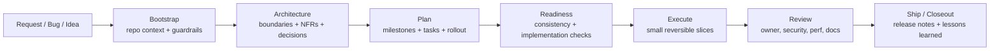

# CodexKit Engineer Pro Final Plus

[English](README.md) | Tiếng Việt | [简体中文](README.zh-CN.md)

**Hệ điều hành kỹ thuật architecture-first cho các team dùng Codex.**

CodexKit giúp AI coding agent bớt giống kiểu "code theo cảm hứng" và giống kỹ sư senior hơn: hiểu repo trước, làm rõ kiến trúc và ràng buộc, lập kế hoạch theo các lát cắt dễ review, xác thực trung thực, và để lại artifact bền vững.

## Vì Sao Team Dùng CodexKit

Phần lớn thiết lập AI coding hiện nay giỏi tạo diff nhưng yếu ở kỷ luật kỹ thuật.

CodexKit xử lý vấn đề đó bằng cách cung cấp cho mỗi repository một mô hình vận hành thống nhất:

- `AGENTS.md` cho guidance và guardrail bền vững
- `.agents/skills/` cho workflow tái sử dụng
- `.codex/agents/` cho cơ chế phân vai specialist
- `plans/templates/` cho artifact spec, architecture, NFR, plan, task, rollout và review
- `scripts/` cho bootstrap, validation và scaffolding có tính quyết định
- `.github/workflows/` cho Codex review và release check ở tầng CI

## Có Gì Trong Bộ Kit

| Thành phần | Số lượng | Vai trò |
|---|---:|---|
| Agents | 22 | Subagent chuyên biệt cho architecture, review, security, docs, debugging, release và hơn thế nữa |
| Skills | 35 | Workflow tái sử dụng cho planning, execution, validation và closeout |
| Aliases | 33 | Shortcut `/ck:` và `$ck-` bao ngoài các skill chính tắc |
| Templates | 23 | Artifact giao hàng cho công việc từ `L0` đến `L3` |
| Workflows | 6 | Tự động hóa GitHub dùng Codex cho review, docs drift, release readiness và architecture gate |
| Runbooks | 9 | Hướng dẫn vận hành bền vững cho release, rollback, debugging và governance |

## Điểm Khác Biệt

- **Ưu tiên kiến trúc, không ưu tiên viết code trước**
- **Spec -> architecture -> NFR -> plan -> tasks -> execute**
- **Phân loại thay đổi rõ ràng** cho lỗi nhỏ, tính năng giới hạn, thay đổi cắt ngang và hệ thống mới
- **Rollback, observability và maintainability** là yêu cầu giao hàng hạng nhất
- **Lớp lệnh mỏng** thay vì một DSL tùy biến khổng lồ
- **Bộ nhớ repo bền vững** để các session sau không phải bắt đầu lại từ số 0

## Bắt Đầu Nhanh

### Cài theo kiểu npm / npx

Sau khi publish repository này lên npm với tên `create-codexkit`, người dùng có thể cài theo kiểu:

```bash
npm create codexkit@latest my-repo
```

Hoặc thêm CodexKit vào một repository có sẵn:

```bash
npx create-codexkit@latest init .
```

Cách này cho trải nghiệm onboarding kiểu sản phẩm lớn hơn, nhưng vẫn đổ về đúng workflow hiện tại của CodexKit.

### Cài thủ công khi cần

### 1. Chép bộ kit vào thư mục gốc repository

Đảm bảo các đường dẫn sau tồn tại:

- `AGENTS.md`
- `.codex/config.toml`
- `.codex/agents/`
- `.agents/skills/`
- `plans/templates/`
- `docs/`
- `scripts/`

Nếu chép tay từ repository này, hãy loại trừ các file phục vụ packaging npm như `package.json`, `bin/`, và `installer/`.

### 2. Bootstrap ngữ cảnh repository

```bash
python3 scripts/bootstrap-codexkit.py --apply
```

Lệnh này sinh ra project memory bền vững trong `docs/project-context/` và dữ kiện repo dạng máy đọc được trong `.codex/project-context/`.

### 3. Xem lại guardrail được sinh ra

Đọc các file này trước:

- `docs/project-context/index.md`
- `docs/project-context/08-project-constitution.md`
- `docs/project-context/13-agent-context.md`
- `docs/project-context/14-continuity.md`

### 4. Kiểm tra bộ kit cục bộ

```bash
scripts/check-kit.sh
```

### 5. Bắt đầu initiative đầu tiên

```bash
scripts/new-feature.sh tenant-rate-limits
```

Sau đó tiếp tục với:

```text
$bootstrap
$continuity-memory
$constitution-governance
$brownfield-mapping
$architecture-discovery
$nfr-capture
$plan-feature
$artifact-consistency
$implementation-readiness
$task-breakdown
$tdd-loop
$execute-plan
```

## Luồng Làm Việc



## Chọn Đúng Lane

### Dự án mới hoặc major subsystem

```bash
scripts/new-project.sh billing-platform
```

Prompt gợi ý:

```text
$bootstrap
$continuity-memory
$constitution-governance
$project-bootstrap
$architecture-review
$architecture-decision
$plan-feature
$artifact-consistency
$implementation-readiness
$task-breakdown
```

### Tính năng mới trong codebase hiện có

```bash
scripts/new-feature.sh tenant-rate-limits
```

Prompt gợi ý:

```text
$bootstrap
$continuity-memory
$constitution-governance
$brownfield-mapping
$architecture-discovery
$nfr-capture
$plan-feature
$artifact-consistency
$implementation-readiness
$task-breakdown
$tdd-loop
$execute-plan
```

### Sửa lỗi nhỏ

```text
$fix-issue
```

Chỉ đi vào lane kiến trúc nếu lỗi đó làm lộ ra vấn đề boundary hoặc design sâu hơn.

## Lớp Lệnh Nhanh

CodexKit thêm một lớp alias mỏng để team đi nhanh hơn mà không phải tạo ra một workflow hệ hai.

Các dạng hỗ trợ:

- `/ck:<alias> [payload]` trong chat
- `$ck-<alias> [payload]` ở chế độ giống skill
- các skill chính tắc như `$plan-feature`

Ví dụ:

```text
/ck:bootstrap
/ck:new-project billing-platform
/ck:feature tenant-rate-limits
/ck:plan-feature add per-tenant rate limits
/ck:ready
/ck:build phase 1
/ck:review
/ck:ship
```

Đọc `docs/command-palette.md` để xem đầy đủ danh mục alias và luật định tuyến.

## Artifact Bắt Buộc Theo Quy Mô Thay Đổi

| Change class | Phạm vi điển hình | Artifact tối thiểu |
|---|---|---|
| `L0` | Lỗi nhỏ, cập nhật docs, thay đổi an toàn một file | Ghi chú validation, có thể kèm repro |
| `L1` | Tính năng giới hạn trong một subsystem | `spec.md`, `analysis.md`, `architecture.md`, `nfr.md`, `plan.md`, `tasks.md`, `test-strategy.md`, `consistency-report.md` |
| `L2` | Thay đổi cắt ngang, migration, nhiều module | Toàn bộ `L1` cộng `decision-matrix.md`, `rollout.md`, `observability.md`, `risk-register.md`, `perf-budget.md`, `threat-model.md` |
| `L3` | Dự án mới, platform capability, subsystem lớn | Toàn bộ `L2` cộng `context-map.md`, `interfaces.md`, `data-model.md`, `runbook.md`, và `adr.md` |

## Bố Cục Repository

```text
.
├── AGENTS.md
├── .codex/
│   ├── config.toml
│   ├── config.mcp.example.toml
│   └── agents/
├── .agents/
│   └── skills/
├── .github/
│   ├── PULL_REQUEST_TEMPLATE.md
│   ├── codex/prompts/
│   └── workflows/
├── docs/
│   └── project-context/
├── plans/
│   ├── active/
│   ├── archive/
│   └── templates/
├── runbooks/
└── scripts/
```

## Thứ Tự Nên Đọc

### Bắt đầu ở đây

- `docs/installation.md`
- `docs/bootstrap-playbook.md`
- `docs/project-memory-system.md`
- `docs/architecture-first-development.md`

### Sau đó học các lane

- `docs/new-project-playbook.md`
- `docs/new-feature-playbook.md`
- `docs/brownfield-playbook.md`
- `docs/quality-gates.md`
- `docs/implementation-readiness.md`

### Sau đó học bề mặt lệnh

- `docs/command-palette.md`
- `docs/skill-catalog.md`
- `docs/agent-roster.md`
- `docs/prompt-playbook.md`

### Muốn đào sâu thêm

- `docs/final-improvements.md`
- `docs/external-benchmark-analysis.md`
- `docs/source-patterns.md`
- `docs/systematic-debugging.md`
- `docs/design-system-forensics.md`
- `docs/initiative-lifecycle.md`

## Khi Nào Phù Hợp

CodexKit rất phù hợp khi:

- team của bạn dùng Codex nhiều và muốn có kỷ luật vượt ra ngoài chat history
- architecture drift, review yếu, hoặc rollout thiếu chắc chắn đang gây đau đầu
- bạn muốn công việc của AI sinh ra artifact mà con người có thể review, audit và tái sử dụng
- bạn cần một workflow lặp lại được xuyên suốt planning, implementation, debugging, review và release

CodexKit có thể hơi nặng khi:

- repository chỉ là spike tạm hoặc prototype bỏ đi
- không có nhu cầu về kiến trúc bền vững, review, hay kỷ luật release
- team chỉ muốn một prompt pack tối giản thay vì một operating model cho repo

## Đọc Thêm

- Cài đặt: `docs/installation.md`
- Tùy biến: `docs/customization-guide.md`
- Lộ trình áp dụng: `docs/adoption-roadmap.md`
- Checklist phát hành: `docs/release-checklist.md`
- Mô hình bảo mật: `docs/security-model.md`

## License

Repository này dùng giấy phép MIT. Xem `LICENSE`.
