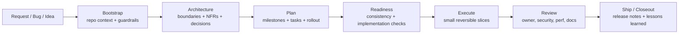

# CodexKit Engineer Pro Final Plus

[English](README.md) | [Tiếng Việt](README.vi.md) | 简体中文

**面向 Codex 团队的 architecture-first 工程操作系统。**

CodexKit 让 AI 编码代理少一些“凭感觉写代码”，多一些资深工程师的工作方式：先理解仓库，再明确架构与约束，按可评审的小切片规划实现，诚实验证，并留下可长期复用的工件。

## 为什么团队会使用 CodexKit

大多数 AI coding 配置都很擅长产出 diff，却不擅长产出工程纪律。

CodexKit 通过为每个仓库提供统一的操作模型来解决这个问题：

- `AGENTS.md` 提供持久化 guidance 和 guardrails
- `.agents/skills/` 提供可复用工作流
- `.codex/agents/` 提供 specialist delegation
- `plans/templates/` 提供 spec、architecture、NFR、plan、task、rollout 和 review 工件
- `scripts/` 提供确定性的 bootstrap、validation 和 scaffolding
- `.github/workflows/` 提供 CI 层的 Codex review 与 release checks

## 套件内容一览

| 组件 | 数量 | 作用 |
|---|---:|---|
| Agents | 22 | 面向架构、评审、安全、文档、调试、发布等场景的专用 subagents |
| Skills | 35 | 用于规划、执行、验证和 closeout 的可复用工作流 |
| Aliases | 33 | `/ck:` 与 `$ck-` 快捷命令，包装规范技能 |
| Templates | 23 | 面向 `L0` 到 `L3` 的交付工件模板 |
| Workflows | 6 | 基于 Codex 的 GitHub 自动化，用于 review、docs drift、release readiness 和 architecture gates |
| Runbooks | 9 | 面向 release、rollback、debugging 与 governance 的长期运维文档 |

## 它有什么不同

- **先做架构，而不是先写代码**
- **Spec -> architecture -> NFR -> plan -> tasks -> execute**
- **明确的变更分级**，覆盖小修复、范围受控的功能、跨模块改动和新系统
- **Rollback、observability 和 maintainability** 是一等交付要求
- **很薄的命令层**，而不是庞大的自定义 DSL
- **持久化仓库记忆**，避免后续 session 从零开始

## 快速开始

### npm / npx 安装方式

当这个仓库以 `create-codexkit` 的名字发布到 npm 之后，用户可以这样安装：

```bash
npm create codexkit@latest my-repo
```

或者把 CodexKit 加进一个已有仓库：

```bash
npx create-codexkit@latest init .
```

这样就能获得更接近成熟产品的 onboarding 体验，同时仍然落到当前这套 CodexKit 工作流上。

### 手动安装作为兜底方案

### 1. 将套件复制到仓库根目录

确保以下路径存在：

- `AGENTS.md`
- `.codex/config.toml`
- `.codex/agents/`
- `.agents/skills/`
- `plans/templates/`
- `docs/`
- `scripts/`

如果你是从这个仓库手动复制文件，请排除 npm packaging 文件，例如 `package.json`、`bin/` 和 `installer/`。

### 2. Bootstrap 仓库上下文

```bash
python3 scripts/bootstrap-codexkit.py --apply
```

这会在 `docs/project-context/` 下生成持久化项目记忆，并在 `.codex/project-context/` 下生成机器可读的仓库事实。

### 3. 审阅生成后的 guardrails

优先阅读：

- `docs/project-context/index.md`
- `docs/project-context/08-project-constitution.md`
- `docs/project-context/13-agent-context.md`
- `docs/project-context/14-continuity.md`

### 4. 在本地验证套件

```bash
scripts/check-kit.sh
```

### 5. 启动第一个 initiative

```bash
scripts/new-feature.sh tenant-rate-limits
```

然后继续使用：

```text
$bootstrap
$continuity-memory
$constitution-governance
$brownfield-mapping
$architecture-discovery
$nfr-capture
$plan-feature
$artifact-consistency
$implementation-readiness
$task-breakdown
$tdd-loop
$execute-plan
```

## 工作流全景



## 选择正确的工作路径

### 新项目或大型子系统

```bash
scripts/new-project.sh billing-platform
```

推荐 prompts：

```text
$bootstrap
$continuity-memory
$constitution-governance
$project-bootstrap
$architecture-review
$architecture-decision
$plan-feature
$artifact-consistency
$implementation-readiness
$task-breakdown
```

### 现有代码库中的新功能

```bash
scripts/new-feature.sh tenant-rate-limits
```

推荐 prompts：

```text
$bootstrap
$continuity-memory
$constitution-governance
$brownfield-mapping
$architecture-discovery
$nfr-capture
$plan-feature
$artifact-consistency
$implementation-readiness
$task-breakdown
$tdd-loop
$execute-plan
```

### 小型缺陷修复

```text
$fix-issue
```

只有当缺陷暴露出更深层的边界或设计问题时，才进入架构路径。

## 快速命令层

CodexKit 增加了一层很薄的 alias 层，让团队可以更快操作，而不会制造第二套工作流系统。

支持形式：

- 聊天中的 `/ck:<alias> [payload]`
- skill 风格模式中的 `$ck-<alias> [payload]`
- 规范 skill 形式，例如 `$plan-feature`

示例：

```text
/ck:bootstrap
/ck:new-project billing-platform
/ck:feature tenant-rate-limits
/ck:plan-feature add per-tenant rate limits
/ck:ready
/ck:build phase 1
/ck:review
/ck:ship
```

完整 alias 目录和路由规则请见 `docs/command-palette.md`。

## 按变更规模要求的工件

| Change class | 典型范围 | 最低工件要求 |
|---|---|---|
| `L0` | 小修复、文档更新、单文件安全改动 | Validation 说明，可选 repro |
| `L1` | 单一子系统中的受控功能 | `spec.md`、`analysis.md`、`architecture.md`、`nfr.md`、`plan.md`、`tasks.md`、`test-strategy.md`、`consistency-report.md` |
| `L2` | 跨模块改动、迁移、多模块修改 | `L1` 全套，再加 `decision-matrix.md`、`rollout.md`、`observability.md`、`risk-register.md`、`perf-budget.md`、`threat-model.md` |
| `L3` | 新项目、平台能力、大型子系统 | `L2` 全套，再加 `context-map.md`、`interfaces.md`、`data-model.md`、`runbook.md` 和 `adr.md` |

## 仓库结构

```text
.
├── AGENTS.md
├── .codex/
│   ├── config.toml
│   ├── config.mcp.example.toml
│   └── agents/
├── .agents/
│   └── skills/
├── .github/
│   ├── PULL_REQUEST_TEMPLATE.md
│   ├── codex/prompts/
│   └── workflows/
├── docs/
│   └── project-context/
├── plans/
│   ├── active/
│   ├── archive/
│   └── templates/
├── runbooks/
└── scripts/
```

## 建议阅读顺序

### 从这里开始

- `docs/installation.md`
- `docs/bootstrap-playbook.md`
- `docs/project-memory-system.md`
- `docs/architecture-first-development.md`

### 然后理解各条工作路径

- `docs/new-project-playbook.md`
- `docs/new-feature-playbook.md`
- `docs/brownfield-playbook.md`
- `docs/quality-gates.md`
- `docs/implementation-readiness.md`

### 然后学习命令面

- `docs/command-palette.md`
- `docs/skill-catalog.md`
- `docs/agent-roster.md`
- `docs/prompt-playbook.md`

### 需要更深入时

- `docs/final-improvements.md`
- `docs/external-benchmark-analysis.md`
- `docs/source-patterns.md`
- `docs/systematic-debugging.md`
- `docs/design-system-forensics.md`
- `docs/initiative-lifecycle.md`

## 适用场景

CodexKit 很适合以下情况：

- 团队大量使用 Codex，并且希望比单纯聊天记录更有纪律
- architecture drift、review 质量不足或 rollout 不稳定已经成为痛点
- 你希望 AI 产出的不仅是 diff，还有人类可审阅、可审计、可复用的工件
- 你需要一套贯穿 planning、implementation、debugging、review 和 release 的可重复工作流

以下情况它可能偏重：

- 仓库只是一次性 spike 或可丢弃原型
- 团队并不需要持久化架构、评审或发布纪律
- 团队只想要轻量 prompt pack，而不是完整的 repo operating model

## 延伸阅读

- 安装：`docs/installation.md`
- 定制：`docs/customization-guide.md`
- 采用路线图：`docs/adoption-roadmap.md`
- 发布清单：`docs/release-checklist.md`
- 安全模型：`docs/security-model.md`

## License

本仓库采用 MIT License。详见 `LICENSE`。
